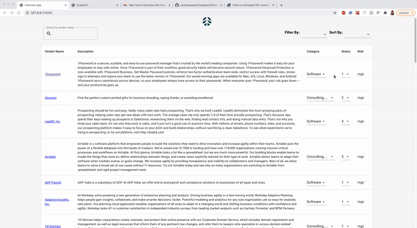
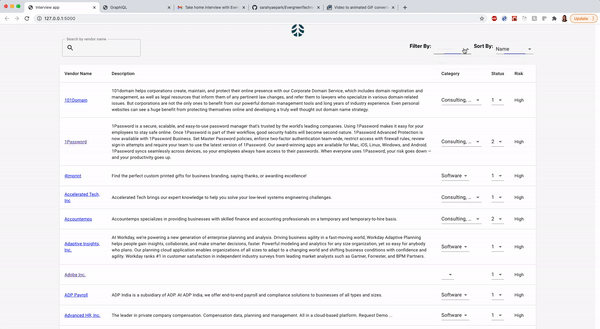
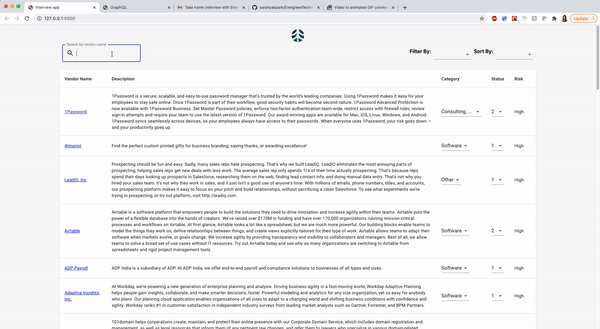
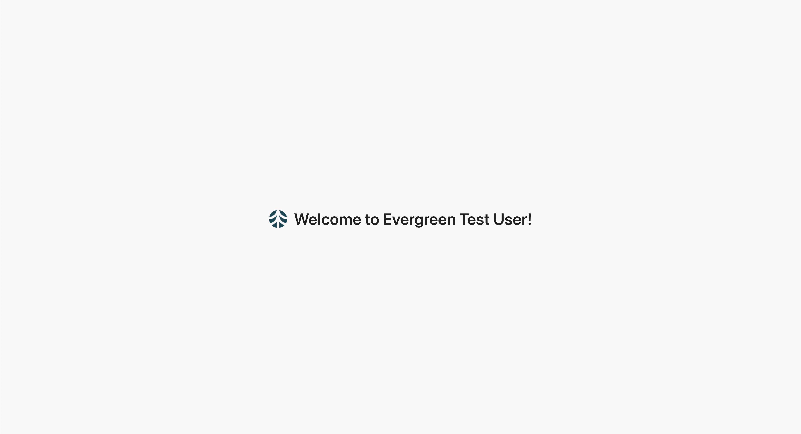

## App Walkthrough

* Display a list/table of vendors managed by the company (Vendor name, description, external link, category, status, risk)


* Allow admins to edit certain fields on the page


* Allow admins to filter by category


* Allow admins to sort by criteria


* Allow admins to search by vendor name


**Possible optimizations**
* search function is brute force-- Could make a hashmap to map vendor name to vendor info for fast lookup instead of looping
* clean up vendor list component
* better check for isAdmin rather than just boolean value

# Backend setup
## Create python3 virtualenv
```
python3 -m venv env
source env/bin/activate # you need to run this before running any python commands
```

## Install dependencies
```
pip install -r requirements.txt
```

## Init db
start `python` interpreter
```
from backend.init_db import init_db
init_db()
```

## Start backend server
```
python backend/application.py
```
Changes to backend code are auto reloaded.

# Frontend setup
## Build packages
```
npm install
```

## Start webpack dev server
In a different command line window
```
npm run start
```
Changes to frontend code are auto reloaded.

# Testing
Graphql query explorer: http://localhost:5000/graphql

Homepage: http://localhost:5000



# Recommanded readings
- React: https://reactjs.org/docs/getting-started.html
- Graphql backend (Graphene): https://graphene-python.org/
- Graphql frontend (Apollo): https://www.apollographql.com/docs/react/
